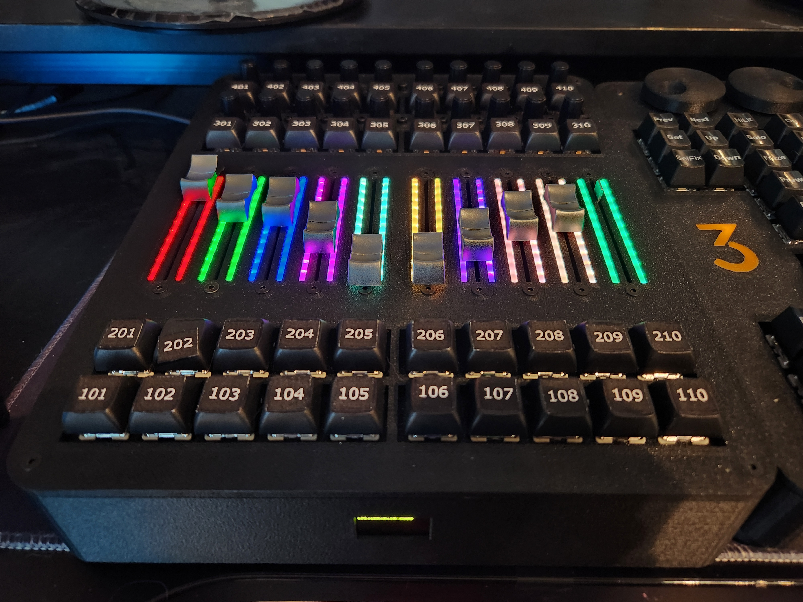

EvoFaderWing - ShawnR - stagehandshawn@gmail.com

OSC control of grandma3 faders with motorized feedback and backlit faders, 20 encoders and 40 standard exec buttons.

This is a WIP but is fully functional, this is not a guide yet as i just do not have the time to make one but here is a limited BOM.

any questions can be asked to me at stagehandshawn@gmail.com, ill help when I can.

There are pinouts in the images, and/or docs folders, this with picture should give you an idea of how youll want to route wires.

I have not coded in years and was never great at it so i leaned on ai to make this happen so the code could use some work i'm sure, lol

Image 00_connections give an idea of layout

There are 3 repos you will need to use to complete this build, this one is the main controller, there are 2 others:
EvoFaderWing_keyboard_i2c
EvoFaderWing_encoder_i2c

These run on atmega328p mcus and they are I2C slaves for getting encoder data from 20 encoder 5 each 4 atega328p's, 1
atmega for the keyboard matrix.

There is a python scrip and a tasks.json for uploading code automatically for when the FaderWing is closed and you can not get to the bootloader button.

More to come, thank you for checking out my project.

You will find most of the BOM here, I will add more when I can, you are probably going to need a decent amount of electronic building gear already
like soldering iron and solder, wires, and general know how of arduino type projects is a big help.

NOTICE: If you enable serial debug you will notice jitter in the faders, serial debug MUST BE TURNED OFF WHEN NOT DEBUGGING

Teensy 4.1 + eth kit
    https://www.amazon.com/dp/B08RSCFBNF?ref=ppx_yo2ov_dt_b_fed_asin_title

Teensy 4.1 breakout board
    https://www.amazon.com/dp/B0BYTHZ6T2?ref_=ppx_hzsearch_conn_dt_b_fed_asin_title_4

JST-XH connector kit
    https://www.amazon.com/dp/B09ZTWCZ3K?ref=ppx_yo2ov_dt_b_fed_asin_title

Jst-XH connectors, hard to find larger sizes so i used these and took the wires out
    https://www.amazon.com/dp/B0D3LW9B6J?ref=ppx_yo2ov_dt_b_fed_asin_title (wires removed)

OLED 128x64
    https://www.amazon.com/dp/B09C5K91H7?ref=ppx_yo2ov_dt_b_fed_asin_title

Encoder knobs
    https://www.amazon.com/dp/B0DZTX96NH?ref=ppx_yo2ov_dt_b_fed_asin_title

Power supply
    https://www.amazon.com/dp/B01D8FLXJU?ref=ppx_yo2ov_dt_b_fed_asin_title
        1x Female DC barrel connector (don't use cheap plastic ones)

LED diffusion
    https://www.amazon.com/dp/B07V3QJW1L?ref=ppx_yo2ov_dt_b_fed_asin_title

Addressable leds 2.7mm (cut to 20 12pixel strips)
    https://www.amazon.com/dp/B0DWWTXJBD?ref=ppx_yo2ov_dt_b_fed_asin_title

Atmega328p 3.3v 8mhz
    https://www.amazon.com/dp/B08LNBYLBT?ref=ppx_yo2ov_dt_b_fed_asin_title

Motor Drivers
    https://www.amazon.com/dp/B0CBLTFDZ3?ref=ppx_yo2ov_dt_b_fed_asin_title

Touch sensor
    https://www.amazon.com/dp/B0DPFZ6TQV?ref=ppx_yo2ov_dt_b_fed_asin_title

Motor Faders 5pk X2
    https://www.amazon.com/dp/B01DT827IC?ref=ppx_yo2ov_dt_b_fed_asin_title

Protoype boards
    https://www.amazon.com/dp/B07ZYNWJ1S?ref=ppx_yo2ov_dt_b_fed_asin_title

Usb C Breakout board
    https://www.amazon.com/dp/B0CB2VFJ54?ref=ppx_yo2ov_dt_b_fed_asin_title

Encoders
    652-PEC12R-4025F-S24 from mouser

Keyboard
    Cherry MX switches
    Keycap of your liking
    Diodes
        https://www.amazon.com/dp/B0CKRMK45V?ref=ppx_yo2ov_dt_b_fed_asin_title
    Wire
        Solid copper wire, 18 or 16awg is fine
        Heatshrink

I2c breakout
    DFRobot DFR0759 from mouser

Dc to dc converter
    DFR1015 from mouser

Wire 
     Various sizes, 28 or 30 for I/O, USE AT LEAST 26AWG PTFE FOR LEDS, this will fit in the small space (if you use ptfe insulated wire) and be large enough for the current, COVER POWER SOLDER CONNECTIONS OF THE LEDS OR THEY WILL SHORT ON THE FADERS, also i did power injection at the other end 
     of the strip, this is what the second 12v connector on the first motor driver board is used for.

 Hardware
    M3 screws 8 to 12mm, flat or buttonhead
    M3 heatset inserts    

When i have time i will mod the channel to be larger as i did not make it large enough on the first print but made it work.

Filiment i used
https://www.amazon.com/dp/B0CSV8XBPV?ref=ppx_yo2ov_dt_b_fed_asin_title